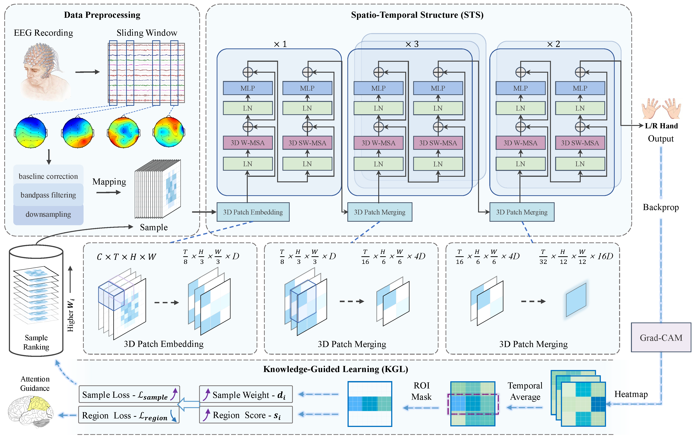

# SwinMI
## SwinMI: An Explainable Swin Transformer for Motor Imagery EEG Classification via Knowledge-Guided Learning

This is the PyTorch implementation of the SwinMI architecture for MI classification. 

# SwinMI: Architecture



## Folder Structure

```
HSSMI_Codes/
│
├── base_dataset.py         # Base dataset and IO management
├── classifier.py           # Training and evaluation logic
├── gradcam.py              # GradCAM and attention map utilities
├── HSSDataset.py           # EEG dataset for HSSMI data
├── hssdict.py              # Channel location dictionary for HSSMI dataset
├── loss_functions.py       # Custom loss functions (region-wise, sample-wise, combined)
├── model.py                # SwinMI model
├── to.py                   # Data transforms
├── Train_SwinMI.py         # Main training script for SwinMI
├── train_test_split.py     # Cross-validation and data splitting utilities

StrokeMI50_Codes/
│
├── classifier.py           # Training and evaluation logic
├── gradcam.py              # GradCAM and attention map utilities
├── loss_functions.py       # Custom loss functions (region-wise, sample-wise, combined)
├── model.py                # SwinMI model
├── StrokeDataset.py        # EEG dataset for StrokeMI50 data
├── strokesdict.py          # Channel location dictionary for StrokeMI50 dataset
├── to.py                   # Data transforms
├── Train_SwinMI.py         # Main training script for SwinMI on StrokeMI50
```